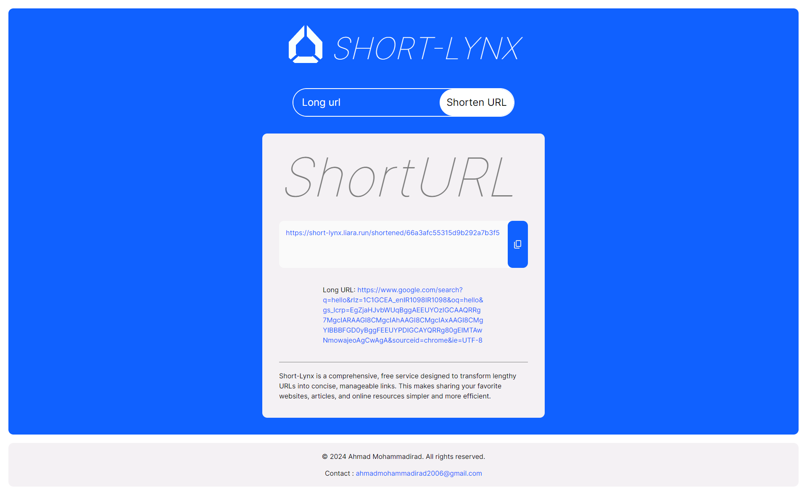

# Short-Lynx

Short-Lynx is a web application that converts long URLs into shorter, uniformly formatted URLs. By entering a long URL, users can generate a shortened link like `https://short-lynx.liara.run/shortened/66a3afc55315d9b292a7b3f5`. This tool is ideal for making URLs more manageable and easier to share on social media, emails, and other platforms where space is limited. The shortened URLs are consistently formatted and contain a unique combination of random numbers and letters.

## Live Demo

You can try the live demo here: [Short-Lynx](https://short-lynx.liara.run/)

## Features

- Shortens any URL to a consistent length.
- Displays the original URL.
- Easy copy functionality for the shortened URL.

## Technologies Used

- Frontend: HTML, TailwindCSS, Pure JavaScript
- Backend: Node.js, MongoDB

## Installation

1. Clone the repository:
   ```sh
   git clone https://github.com/ahmadmohammadirad2006/short-lynx.git
   ```
2. Navigate to the project directory:
   ```sh
   cd short-lynx
   ```
3. Install the dependencies:
   ```sh
   npm install
   ```
4. Create a `.env` file in the root directory and add your environment variables:

   ```plaintext
   NODE_ENV=development  # The environment in which the app is running
   PORT=8000  # The port on which the app will run

   DATABASE=your_database_connection_string  # Your database connection string
   DATABASE_PASSWORD=your_database_password  # Your database password

   ADMIN_TOKEN=your_admin_token  # Token for request authorization (delete/update/read URLs)

   BASE_URL=http://localhost:8000  # The domain where the app is running
   ```

5. Start the application:
   ```sh
   npm start
   ```

## Usage

- Open your browser and go to `http://localhost:8000`.
- Enter a URL in the input field and click on "Shorten URL".
- Copy the shortened URL from the textarea.

## Screenshot



## Contributing

Contributions are welcome! Please submit a pull request or open an issue to discuss what you would like to change.
